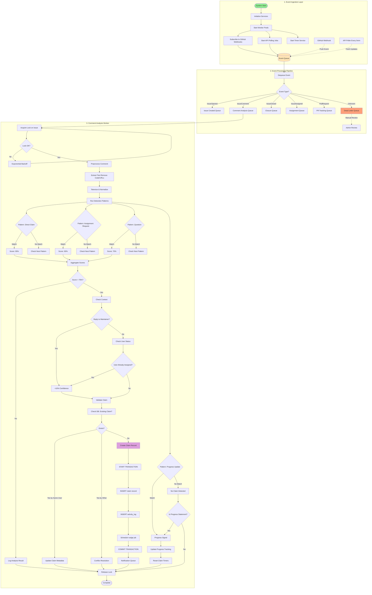

# Cookie-Licking Detector - Project Documentation

## Table of Contents
1. [Project Overview](#project-overview)
2. [Problem Statement](#problem-statement)
3. [Solution Overview](#solution-overview)
4. [System Requirements](#system-requirements)
5. [Technical Architecture](#technical-architecture)
6. [Logical Flowcharts](#logical-flowcharts)
7. [Implementation Plan](#implementation-plan)
8. [API Integration](#api-integration)
9. [Features and Functionality](#features-and-functionality)
10. [Technology Stack](#technology-stack)
11. [Development Timeline](#development-timeline)
12. [Testing Strategy](#testing-strategy)
13. [Database Design](#database-design)
14. [API Design](#api-design)
15. [Security Considerations](#security-considerations)
16. [Performance Optimization](#performance-optimization)
17. [Potential Challenges](#potential-challenges)
18. [Future Enhancements](#future-enhancements)

## Project Overview

The Cookie-Licking Detector is a system designed to identify GitHub issues that have been "claimed" by users but not completed. The project aims to reduce the blocking effect of unfulfilled issue claims and improve the open source contribution experience for both maintainers and newcomers.

### Key Objectives:
- Detect claimed but inactive issues
- Send automated reminders to inactive claimants
- Auto-release stale claims after a grace period
- Improve contribution flow in open source projects

## Problem Statement

In open source communities, users often "claim" issues by commenting phrases like "I'll work on this" or "please assign to me" but then never deliver. This phenomenon, known as "cookie-licking," creates several problems:

1. **Frustrates newcomers** who might want to work on unassigned issues
2. **Slows project progress** by leaving important tasks uncompleted
3. **Blocks maintainers** who must manually follow up with inactive claimants
4. **Gives false impressions** that issues are being worked on when they're not
5. **Reduces contribution opportunities** for active contributors

## System Requirements

### Functional Requirements:
1. **Issue Monitoring**: Continuously monitor GitHub repositories for new issues and comments
2. **Claim Detection**: Identify when users claim issues through comments or assignments
3. **Progress Tracking**: Monitor for actual progress on claimed issues (commits, PRs, activity)
4. **Notification System**: Send automated reminders to inactive claimants
5. **Auto-Release**: Automatically unassign stale claims after configurable grace period
6. **Dashboard**: Provide maintainers with visibility into system operations
7. **Configuration**: Allow maintainers to configure grace periods and notification settings

### Non-Functional Requirements:
1. **Performance**: Process new issues and comments within 5 minutes
2. **Reliability**: System should have 99% uptime during peak hours
3. **Scalability**: Handle monitoring of 1000+ repositories simultaneously
4. **Security**: Protect user data and respect GitHub API terms
5. **Privacy**: Do not store unnecessary personal information
6. **Compliance**: Follow GitHub API and Ecosyste.ms API terms of service

### Data Requirements:
1. **Issue Data**: Repository, issue number, title, description, comments
2. **User Data**: GitHub username, claim timestamp, progress indicators
3. **Activity Data**: Commits, PRs, issue updates associated with claims
4. **System Data**: Notification history, auto-release records, system logs

## Solution Overview

The Cookie-Licking Detector will:
1. Monitor GitHub repositories for issue claims (comments indicating intent to work)
2. Track progress on claimed issues (commits, PRs, continued activity)
3. Send polite nudges to users who haven't shown progress within a timeframe
4. Auto-release stale claims to make issues available to others
5. Provide maintainers with visibility into the effectiveness of the system

This solution leverages the Ecosyste.ms API to access GitHub data while respecting rate limits.

## Technical Architecture

### System Components:
1. **Event Ingestion Layer** - Receives GitHub webhooks and polls APIs for updates
2. **Event Processing Pipeline** - Routes different event types to appropriate worker queues
3. **Comment Analysis Worker** - Processes issue comments through pattern matching with confidence scoring
4. **Issue Tracking Engine** - Core logic for tracking claimed issues
5. **Progress Monitoring System** - Tracks activity on claimed issues
6. **Notification Service** - Sends reminders and updates
7. **Auto-Release Mechanism** - Handles releasing stale claims
8. **Dashboard/Interface** - Shows maintainers the system status
9. **Configuration Manager** - Handles repository-specific settings
10. **Analytics Engine** - Generates insights and metrics
11. **Cache Layer** - Temporary storage for performance optimization
12. **Database Layer** - Persistent storage for issues, claims, and activities
13. **Queue System** - Manages background jobs and processing workflows

### Data Flow:
```
GitHub Issues → Ecosyste.ms API → Issue Analysis → Claim Detection → Progress Tracking → Nudge/Auto-Release → Results
```

### High-Level Architecture Diagram:
```
┌─────────────────┐    ┌─────────────────┐    ┌─────────────────┐
│   GitHub API    │───▶│ Ecosyste.ms API│───▶│  Issue Tracker  │
│   (Raw Data)    │    │ (Aggregated)    │    │                 │
└─────────────────┘    └─────────────────┘    └─────────────────┘
                                                      │
┌─────────────────┐    ┌─────────────────┐           ▼
│ Progress Monitor│◀───│  Notification   │    ┌─────────────────┐
│                 │    │    Service      │───▶│  Auto-Release   │
└─────────────────┘    └─────────────────┘    │   System        │
              │                                 └─────────────────┘
              ▼
    ┌─────────────────┐
    │  Dashboard/UI   │
    │                 │
    └─────────────────┘
```

### Detailed Component Architecture:
```
┌─────────────────────────────────────────────────────────────────┐
│                    Cookie-Licking Detector                      │
├─────────────────────────────────────────────────────────────────┤
│  ┌─────────────────┐  ┌─────────────────┐  ┌─────────────────┐  │
│  │   Webhook       │  │   API Client    │  │   Data Store    │  │
│  │   Receiver      │  │   (Ecosyste.ms) │  │   (Database)    │  │
│  └─────────────────┘  └─────────────────┘  └─────────────────┘  │
│            │                     │                    │         │
│            ▼                     ▼                    ▼         │
│  ┌─────────────────┐  ┌─────────────────┐  ┌─────────────────┐  │
│  │   Event         │  │   Issue         │  │   Claim         │  │
│  │   Processor     │  │   Analyzer      │  │   Tracker       │  │
│  └─────────────────┘  └─────────────────┘  └─────────────────┘  │
│            │                     │                    │         │
│            ▼                     ▼                    ▼         │
│  ┌─────────────────┐  ┌─────────────────┐  ┌─────────────────┐  │
│  │   Claim         │  │   Progress      │  │   Notification  │  │
│  │   Detector      │  │   Monitor       │  │   Service       │  │
│  └─────────────────┘  └─────────────────┘  └─────────────────┘  │
│            │                     │                    │         │
│            ▼                     ▼                    ▼         │
│  ┌─────────────────┐  ┌─────────────────┐  ┌─────────────────┐  │
│  │   Auto-Release  │  │   Analytics     │  │   Dashboard     │  │
│  │   Engine        │  │   Engine        │  │   Interface     │  │
│  └─────────────────┘  └─────────────────┘  └─────────────────┘  │
└─────────────────────────────────────────────────────────────────┘
```

## Logical Flowcharts

### 1. Main System Flow
```
Start
  │
  ▼
Monitor Repositories for New Issues/Comments
  │
  ▼
Is Issue Claimed? ──────────────────────┐
  │Yes                                │No
  ▼                                   │
Record Claim & Set Timer              │
  │                                   │
  ▼                                   │
Monitor for Progress (Commits/PRs)    │
  │                                   │
  ▼                                   │
Has Progress Been Made? ──────┐       │
  │Yes                        │No      │
  ▼                           ▼       │
Reset Timer & Continue    Is Grace      │
    │                   Period Over?   │
    │                        │Yes      │
    │                        ▼         │
    │            Send Nudge & Reset    │
    │                   Timer         │
    │                        │No      │
    │                        ▼         │
    └────────────────► Continue ───────┘
                        Monitoring
```

### 2. Claim Detection Flow
```
Receive Issue Comment
  │
  ▼
Normalize Comment Text
  │
  ▼
Apply Claim Detection Rules
  │
  ▼
Does Comment Match Claim Pattern?
  │Yes            │No
  ▼               ▼
Check Assignment Status
  │
  ▼
Is Issue Assigned to Commenter?
  │Yes            │No
  ▼               ▼
Is Issue Previously Claimed?
  │Yes            │No
  ▼               ▼
Update Claim Record
  │
  ▼
Set Initial Timer
  │
  ▼
Trigger Progress Monitoring
```

### 3. Progress Monitoring Flow
```
Monitor Claimed Issue
  │
  ▼
Check for Associated PRs
  │
  ▼
Are There New PRs for This Issue?
  │Yes            │No
  ▼               ▼
Check PR Status ──┘
  │
  ▼
Is PR Open/Merged?
  │Yes            │No
  ▼               ▼
Mark as Progress ─┘
  │ Made
  ▼
Update Claim Status
  │
  ▼
Reset Inactivity Timer
```

### 4. Notification & Auto-Release Flow
```
Timer Expires
  │
  ▼
Check Issue Activity
  │
  ▼
Any Recent Activity?
  │Yes            │No
  ▼               ▼
Reset Timer ──► Send Nudge Notification
                    │
                    ▼
              Update Notification Log
                    │
                    ▼
              Is This First Nudge?
                    │Yes     │No
                    ▼         ▼
              Reset Timer  Is Max Nudges
                              │
                              ▼
                         Mark for Auto-Release
                              │
                              ▼
                         Execute Auto-Release
                              │
                              ▼
                         Notify Maintainer
```

### 5. Dashboard Data Flow
```
System Events → Data Aggregation → Metric Calculation → Dashboard Display
      │              │                    │                    │
      ▼              ▼                    ▼                    ▼
 Issue Claims   Claim Status      Detection Metrics    Visual Analytics
 Progress        Notifications      Effectiveness        Interactive UI
 Auto-Release    System Logs        Time-to-Release      Configuration

### 6. Detailed Processing Pipeline Flowchart



## Implementation Plan

### Phase 1: Data Collection & Processing
- Set up issues.ecosyste.ms API integration
- Implement queue system (Redis + Bull/Celery) for event processing
- Develop comment parsing logic with pattern matching and scoring
- Build data storage system for issues, claims, and activity logs
- Create basic progress tracking mechanism using PR and commit data

### Phase 2: Detection & Notification Logic
- Implement claim detection algorithm with multi-level pattern matching and confidence scoring (75% threshold)
- Add context-aware analysis (reply to maintainer gets +10% boost, user assignment status validation)
- Develop distributed locking mechanism with Redis for concurrent issue processing
- Implement lock acquisition with retry mechanism using exponential backoff
- Create atomic transactional operations for claim creation (INSERT claim record + INSERT activity_log + SCHEDULE nudge job)
- Develop notification system with scheduled nudge jobs
- Create auto-release functionality after configurable grace period
- Implement conflict resolution for existing claims by same/other users

### Phase 3: Queue Management & Conflict Resolution
- Build queue job scheduling for periodic checks
- Implement conflict resolution for multiple claims on same issue
- Add dead-letter queue for failed jobs requiring manual review
- Create retry mechanisms with exponential backoff

### Phase 4: Dashboard & Interface & Testing
- Build admin/maintainer dashboard
- Create visualization of cookie-licking detection metrics
- Add configuration options for different repositories
- Design user feedback mechanisms
- Test on live repositories
- Refine claim detection patterns and algorithms
- Optimize performance and API usage

## API Integration

#### Ecosyste.ms API Usage

The project will utilize Ecosyste.ms API for accessing GitHub data:

#### Available Datasets:
- **Issues**: 16 million issues and 38 million pull requests across 8.5 million repositories
- **Timeline Events**: 6 billion events for every public repo on GitHub
- **Commits**: 882 million commits across 2.3 million repositories
- **Repositories**: Metadata for 278 million repositories

#### Key Data Points:
- Issue creation and status updates
- Comments on issues (crucial for claim detection)
- Pull request associations with issues
- Assignment status and changes
- Timeline of activity events
- User information for issue participants

#### API Advantages:
- Better rate limits than direct GitHub API (60 requests per minute per IP)
- Aggregated, cross-referenced data
- Historical data access
- Designed for ecosystem analysis tools
- Provides comprehensive issue data including comments and events

#### Rate Limiting:
- Polite Pool: For known users who provide an email address via `mailto=you@example.com` parameter
- Common Pool: For everyone else with less consistent response times during peak periods
- 60 requests per minute per IP for most endpoints

#### API Implementation Strategy:
1. **Data Ingestion**: Query specific issues and their comments/events from Ecosyste.ms API
2. **Claim Detection**: Implement pattern matching on comment bodies to identify issue claims
3. **Progress Tracking**: Monitor for PRs and commits associated with claimed issues
4. **Data Storage**: Store relevant data locally for processing and analytics

### Integration Approach:
1. Query issues.ecosyste.ms API for specific repository issues
2. Parse comments for claim indicators using pattern matching on comment bodies
3. Monitor for associated PRs and commits to the same repository
4. Track activity patterns over time to detect inactivity

## Features and Functionality

### Core Features:
1. **Issue Claim Detection**
   - Pattern matching on issue comments using Ecosyste.ms API with multi-level confidence scoring
   - Detection patterns with scores: Direct claims (95%), Assignment requests (90%), Questions (70%), Progress updates (for progress tracking)
   - Context-aware analysis (replies to maintainers get +10% confidence boost)
   - User assignment status validation to boost confidence
   - Atomic claim creation with distributed locking to prevent race conditions
   - Conflict resolution with atomic database checks for existing claims by same/other users
- Different handling for: same user updating metadata, different user requiring conflict resolution, no existing claim creating new record
   - Transactional operations for consistent claim creation including activity log entry and scheduled nudge job

2. **Progress Tracking**
   - Linking commits and PRs to claimed issues within the same repository
   - Monitoring for associated pull requests
   - Activity timeline analysis using Ecosyste.ms data
   - Progress update detection and timer reset functionality

3. **Notification System**
   - Automated reminders to inactive claimants via email or GitHub comments
   - Configurable grace periods per repository
   - Polite, helpful messaging with scheduled nudge jobs
   - Configurable number of nudges before auto-release

4. **Auto-Release Mechanism**
   - Automatic removal of assignee status after grace period
   - Notification to maintainers when claims are released
   - Prevention of false positives through multiple verification checks
   - Transactional operations to ensure data consistency

### Advanced Features (if time permits):
1. **Reputation System**
   - Track user completion rates
   - Adjust claim limits based on history
   - Identify frequent "cookie-lickers"

2. **Time-Boxed Claims**
   - Allow users to claim issues for specific timeframes
   - Automatic release when timeframe expires

3. **Dashboard Analytics**
   - Visualize cookie-licking trends
   - Impact metrics (issues completed, time saved)
   - Repository-specific insights

## Database Design

### Core Entities

#### 1. Issues Table
```
issues
├── id (Primary Key)
├── github_repo_id (Foreign Key)
├── github_issue_number
├── title
├── description
├── status (open/closed)
├── created_at
├── updated_at
└── github_data (JSON - raw GitHub issue data)
```

#### 2. Claims Table
```
claims
├── id (Primary Key)
├── issue_id (Foreign Key)
├── github_user_id
├── github_username
├── claim_comment_id
├── claim_text
├── claim_timestamp
├── status (active/inactive/completed/released)
├── first_nudge_sent_at
├── last_activity_timestamp
├── auto_release_timestamp
├── release_reason
├── confidence_score (0-100, calculated during claim detection)
├── context_metadata (JSON - reply context, user assignment status)
└── created_at
```

#### 3. Repositories Table
```
repositories
├── id (Primary Key)
├── github_repo_id
├── owner
├── name
├── url
├── is_monitored
├── grace_period_days
├── nudge_count
├── notification_settings (JSON)
├── claim_detection_threshold (minimum confidence score)
└── created_at
```

#### 4. Activity Log Table
```
activity_log
├── id (Primary Key)
├── claim_id (Foreign Key)
├── activity_type (progress_nudge/auto_release/comment/claim_detected)
├── description
├── timestamp
└── metadata (JSON)
```

#### 5. Progress Tracking Table
```
progress_tracking
├── id (Primary Key)
├── claim_id (Foreign Key)
├── pr_number
├── pr_status (open/closed/merged)
├── commit_count
├── last_commit_date
├── updated_at
└── detected_from (ecosyste_ms_api/github_api)
```

#### 6. Queue Jobs Table
```
queue_jobs
├── id (Primary Key)
├── job_type (nudge_check/progress_check/auto_release_check/comment_analysis)
├── payload (JSON - issue_id, claim_id, user_data, etc.)
├── scheduled_at
├── processed_at
├── status (pending/processing/completed/failed/dead_letter)
├── retry_count
├── max_retries
└── created_at
```

### Database Relationships
```
repositories (1) ─── (M) issues
issues (1) ──────── (M) claims
claims (1) ──────── (M) activity_log
claims (1) ──────── (1) progress_tracking
queue_jobs ──────── (0..1) claims (for jobs related to claims)
```

### Indexes for Performance
- Index on `claims.status` for quick filtering
- Composite index on `(issue_id, github_user_id)` for unique claims
- Index on `claims.last_activity_timestamp` for timeout detection
- Index on `repositories.is_monitored` for active repo selection
- Index on `queue_jobs.scheduled_at` for scheduled job processing
- Index on `queue_jobs.status` for job state management

## API Design

### Pattern Matching Algorithm Details

The system implements a multi-level pattern matching algorithm with confidence scoring:

#### Claim Detection Patterns:
1. **Direct Claim (95% confidence)**: Phrases like "I'll take this", "I'll work on this", "I can handle this"
2. **Assignment Request (90% confidence)**: Phrases like "Please assign to me", "I want to work on this"
3. **Question (70% confidence)**: Phrases like "Can I work on this?", "Is this available?"
4. **Progress Update**: Phrases indicating progress to reset timers

#### Context Analysis:
- Replies to maintainers get a +10% confidence boost
- Users already assigned to the issue get a confidence boost
- Multiple validation checks to reduce false positives

### Internal API Endpoints

#### 1. Repository Management
```
POST /api/repositories
- Register a new repository for monitoring
- Body: { owner: string, name: string, grace_period_days: int, nudge_count: int }

GET /api/repositories
- List monitored repositories
- Query params: status, pagination

PUT /api/repositories/{id}
- Update repository settings
- Body: { grace_period_days: int, nudge_count: int, is_monitored: boolean }

DELETE /api/repositories/{id}
- Stop monitoring a repository
```

#### 2. Claim Management
```
GET /api/claims
- List all claims with filtering
- Query params: status, repo, user, date range

GET /api/claims/{id}
- Get specific claim details

POST /api/claims/{id}/nudge
- Manually send a nudge for a claim

POST /api/claims/{id}/release
- Manually release a claim
```

#### 3. Progress Tracking
```
GET /api/progress/{claim_id}
- Get progress details for a claim
- Includes PR status, commit activity

POST /api/progress/{claim_id}/update
- Force update progress tracking
```

#### 4. Dashboard Endpoints
```
GET /api/dashboard/stats
- Overall system statistics
- Total claims, active claims, released claims

GET /api/dashboard/repositories
- Repository-specific metrics
- Active claims per repo, success rate

GET /api/dashboard/users
- User activity metrics
- Claim completion rates
```

### External API Integration

#### Ecosyste.ms API Integration Points
```
GET https://issues.ecosyste.ms/api/v1/issues
- Fetch issues with filters (state, labels, date ranges, etc.)

GET https://issues.ecosyste.ms/api/v1/issues/{id}
- Get specific issue by ID

GET https://issues.ecosyste.ms/api/v1/issues/{id}/comments
- Get comments for a specific issue

GET https://issues.ecosyste.ms/api/v1/issues/{id}/events
- Get timeline events for a specific issue

GET https://timeline.ecosyste.ms/api/v1/timeline
- Get ecosystem-wide timeline events (filterable)

GET https://timeline.ecosyste.ms/api/v1/events
- Get specific events with filters
```

### Actual Data Structure
Issues response includes:
- `id` - Internal ID
- `github_id` - GitHub's ID
- `repository` - Repository information
- `author` - Author information
- `title` - Issue title
- `body` - Issue body
- `state` - open/closed
- `labels` - Array of labels
- `assignees` - Array of assignees
- `comments` - Array of comments
- `events` - Array of timeline events

Comments include:
- `body` - Comment content
- `user` - GitHub user who made the comment
- `created_at` - Timestamp of the comment

These fields are essential for detecting claims through comment pattern matching since there's no dedicated "claimed" field.

## Security Considerations

### 1. Data Privacy
- Store only necessary GitHub identifiers, not personal information
- Implement data retention policies
- Encrypt sensitive configuration data
- Anonymize user data where possible

### 2. API Security
- Implement rate limiting for internal API endpoints
- Use authentication for dashboard access
- Validate all input parameters
- Sanitize GitHub comments to prevent injection

### 3. GitHub Integration Security
- Use GitHub Apps with minimal required permissions
- Store GitHub tokens securely
- Implement proper webhook validation
- Respect GitHub's API usage guidelines

### 4. Access Control
- Role-based access for dashboard users
- Repository-specific permissions
- Audit logging for all actions
- Secure session management

## Performance Optimization

### 1. Caching Strategy
- Cache Ecosyste.ms API responses to reduce calls
- Cache repository settings and configurations
- Cache issue metadata for faster lookups
- Implement cache expiration policies

### 2. Database Optimization
- Use connection pooling
- Implement database indexing
- Optimize queries with eager loading
- Use read replicas for dashboard queries
- Implement proper locking mechanisms for concurrent access to issues

### 3. Processing Optimization
- Use background job queues (Bull/Redis, Celery) for heavy processing
- Implement distributed issue-level locking using Redis to prevent concurrent processing conflicts
- Handle lock acquisition failures with exponential backoff retry mechanism
- Batch process multiple repositories
- Implement stream processing for real-time updates
- Optimize claim detection algorithms with configurable scoring thresholds (75% default)
- Use atomic transactional operations for data consistency during claim creation

### 4. Queue System Optimization
- Implement job prioritization for urgent claims
- Use exponential backoff for failed jobs
- Monitor queue depth and processing latency
- Implement dead-letter queues for failed jobs requiring manual review

### 5. API Optimization
- Implement pagination for large datasets
- Use compression for API responses
- Implement caching headers
- Minimize data transfer with selective fields
- Use polite pool with email identification for Ecosyste.ms API to improve rate limits

## Technology Stack

### Backend:
- **Language**: Python or Node.js
- **Framework**: Flask/FastAPI (Python) or Express (Node.js)
- **Database**: PostgreSQL for storing issue data, claims, and monitoring state
- **Queue System**: Redis with Celery (Python) or Bull (Node.js) for background jobs
- **HTTP Client**: For API requests to issues.ecosyste.ms and GitHub API
- **Locking Service**: Redis-based distributed locks for concurrent access control

### Frontend (Dashboard):
- **Framework**: React or Vue.js
- **Styling**: Bootstrap or Tailwind CSS
- **Charts/Visualization**: Chart.js or D3.js

### Communication:
- **Email Service**: For notifications (SendGrid, Mailgun)
- **GitHub API**: For direct issue management (assignments, comments)
- **API Integration**: To issues.ecosyste.ms for comprehensive issue data

### Deployment:
- **Platform**: Heroku, Vercel, or AWS
- **Containerization**: Docker (optional)
- **Message Queue**: Redis for job processing and state management

## Development Timeline

### Week 1: Foundation
- Set up development environment
- Integrate with issues.ecosyste.ms API
- Design database schema for issues, claims, and activity
- Create basic data fetching and storage functions

### Week 2: Core Logic
- Implement comment pattern matching for claim detection
- Build progress tracking system for PRs and commits
- Create notification logic with email/GitHub integration
- Develop auto-release mechanism using GitHub API

### Week 3: Interface & Integration
- Build admin dashboard for maintainers
- Create repository configuration interface
- Integrate with GitHub API for issue assignments and comments
- Test with sample repositories

### Week 4: Testing & Polish
- Extensive testing on live repositories
- Refine pattern matching algorithms
- Optimize API usage and performance
- Prepare final presentation

## Testing Strategy

### Unit Tests:
- Comment pattern matching algorithms with multi-level scoring (direct claims 95%, assignment requests 90%, etc.)
- Multi-pattern detection and score aggregation logic
- Progress tracking logic for progress updates
- Notification system functions
- Database operations and data storage
- API response parsing and validation
- Queue job scheduling and processing
- Distributed locking mechanisms with retry logic
- Transactional operation handling with atomic commits
- Issue-level lock acquisition and release
- Conflict resolution when multiple users claim same issue

### Integration Tests:
- End-to-end issue monitoring workflows from webhook reception to claim detection
- issues.ecosyste.ms API integration for comment and event retrieval
- GitHub API integration for assignments and comment posting
- Queue system processing including comment analysis and nudge jobs
- Distributed locking and concurrent access handling
- Transactional operations for claim creation (claim + activity log + scheduled job)
- Error handling and retry mechanisms with exponential backoff
- Notification delivery and auto-release workflows
- Conflict resolution for multiple claims on same issue
- Dead-letter queue processing for failed jobs

### User Acceptance Tests:
- Test with real repositories
- Gather feedback from maintainers
- Validate effectiveness in detecting cookie-licking through pattern matching
- Measure impact on contribution flow
- Test queue job reliability and dead-letter queue handling

### Performance Tests:
- API rate limit handling and optimization using polite pool
- Large repository processing efficiency
- Concurrent issue processing with distributed locking
- Lock acquisition failure handling with exponential backoff
- Database query optimization for claim status checks
- Pattern matching algorithm efficiency and scoring accuracy
- Queue throughput and job processing latency
- Distributed lock acquisition and release performance
- Transactional operation performance under load
- Multi-pattern detection and score aggregation performance

## Potential Challenges

1. **False Positives**
   - Distinguishing between "researching" and "inactive"
   - Handling legitimate delays in work
   - Avoiding harassment of contributors

2. **API Limitations**
   - Understanding Ecosyste.ms API capabilities
   - Handling rate limits effectively
   - Managing data consistency

3. **User Experience**
   - Creating polite, helpful notifications
   - Avoiding automated message fatigue
   - Balancing automation with human touch

4. **Technical Complexity**
   - Natural language processing for claim detection
   - Real-time monitoring vs batch processing
   - Scalability for large repositories

## Future Enhancements

1. **Advanced Analytics**
   - Predictive modeling for completion likelihood based on user history
   - Community health metrics around contribution patterns
   - Trend analysis over time for different repositories

2. **Enhanced Detection**
   - Machine learning models trained on the multi-level pattern matching with confidence scores
   - Advanced natural language processing for more nuanced claim detection beyond keyword matching
   - Context-aware detection considering reply chains, user history, and issue complexity
   - Dynamic confidence threshold adjustment based on repository-specific patterns

3. **Integration Improvements**
   - Direct GitHub App integration for real-time event processing
   - Slack/Discord notifications for maintainers
   - Integration with project management tools (ZenHub, Waffle, etc.)

4. **Community Features**
   - Issue hand-off mechanisms for collaborative completion
   - Reputation system based on completion rates
   - Integration with mentorship platforms for complex issues

## Conclusion

The Cookie-Licking Detector addresses a real and significant problem in open source communities. By leveraging the issues.ecosyste.ms API for comprehensive issue data including comments and events, the project can effectively identify unfulfilled issue claims through pattern matching on comment content. The solution has clear technical requirements, measurable impact through improved contribution flow, and scalability for future enhancements. The approach is technically feasible and addresses the core problem of inactive issue claims that block newcomers and slow project progress.